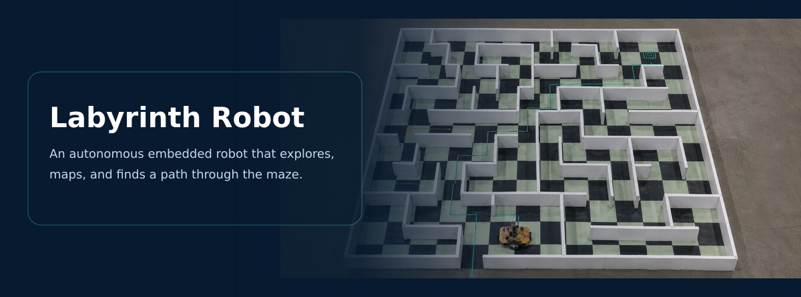
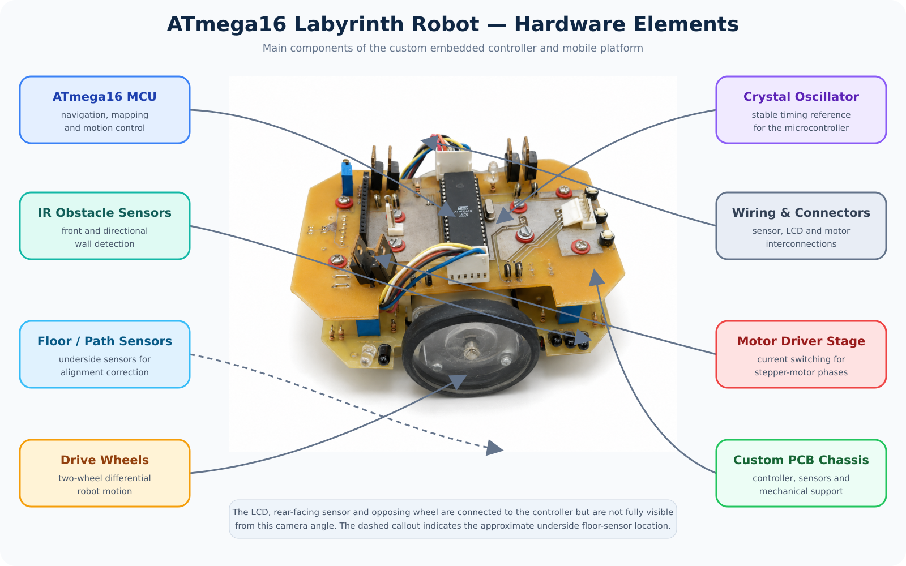
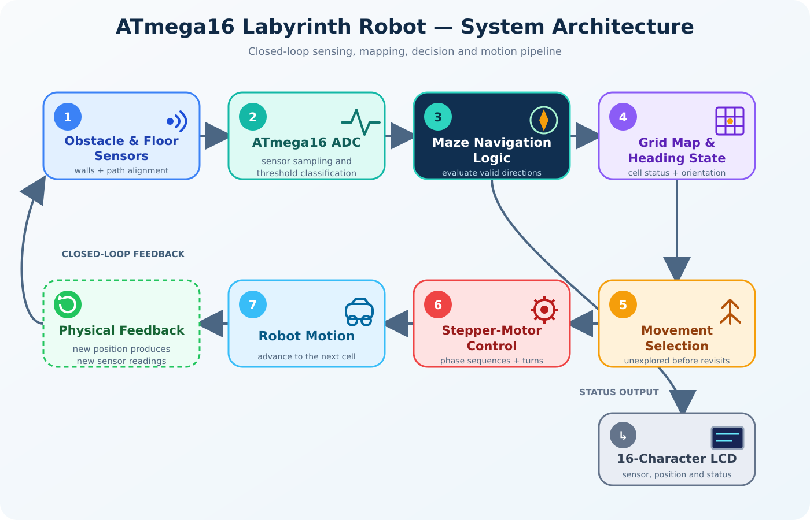
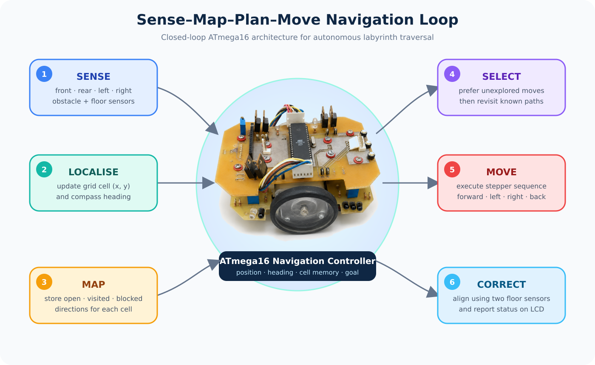

# ATmega16 Autonomous Maze-Solving Robot

<p align="center">
  
</p>

<p align="center">
  <strong>
    A physical embedded mobile robot that senses obstacles, maintains an internal maze representation, tracks its position and orientation, and autonomously explores a bounded labyrinth to reach a predefined goal.
  </strong>
</p>

<p align="center">
  
  
  
  
  
</p>

---

# Introduction

This project is an autonomous physical maze-exploration robot developed around the **ATmega16 AVR microcontroller**.

The goal of the project was to design a small mobile robot capable of navigating a bounded labyrinth without external control.

To achieve this, the robot needed to perform several tasks autonomously:

* detect obstacles around itself;
* determine which directions were available;
* maintain an estimate of its grid position;
* track its current orientation;
* remember which paths had already been explored;
* decide where to move next;
* physically execute forward and turning motions;
* correct movement errors using sensor feedback;
* stop when it reached a predefined goal cell.

The project therefore combines several fundamental robotics concepts:

**perception, embedded control, localisation, mapping, navigation, motor actuation, and closed-loop feedback.**

The robot was not simply programmed to react to the closest wall. Instead, it maintained a small internal memory of previously explored maze cells and used this information to guide future decisions.

---

# The Physical Robot

<p align="center">
  
</p>

<p align="center">
  <em>Figure 1. Physical prototype of the autonomous maze-solving robot.</em>
</p>

The robot was built as a custom embedded mobile platform rather than using a commercial robotics kit.

Its main components included:

* an **ATmega16 microcontroller**;
* directional obstacle sensors;
* two floor/path sensors;
* two stepper motors;
* motor-drive electronics;
* a 16-character LCD;
* a custom PCB and mechanical chassis.

The ATmega16 was responsible for the entire control loop:

```text
Sensors
   ↓
ATmega16
   ↓
Navigation decision
   ↓
Motor commands
   ↓
Physical movement
   ↓
New sensor measurements
```

This means the robot operated as a complete autonomous embedded system.

---

# Robot Hardware

<p align="center">
  
</p>

<p align="center">
  <em>Figure 2. Labelled view of the physical robot and its major hardware components.</em>
</p>

The labelled image above shows the physical arrangement of the robot's main components.

The platform uses a **two-level PCB/chassis structure** that integrates the controller, sensor interfaces, motor electronics, wiring, and mechanical support.

The main components visible in the image correspond to different parts of the robot's perception and actuation system.

### ATmega16 microcontroller

The ATmega16 acts as the central controller.

It performs:

* ADC sensor acquisition;
* state tracking;
* maze-memory updates;
* movement selection;
* stepper-motor sequencing;
* LCD output.

### Directional obstacle sensors

Obstacle sensors are placed around the robot to detect walls or barriers in different directions.

The firmware maintains four logical obstacle states:

```text
Front
Rear
Left
Right
```

These sensor values determine which neighbouring maze cells are physically reachable.

### Stepper motors and wheels

Two independently controlled motors provide differential-drive movement.

By changing the stepping sequence of the left and right motors, the robot can:

* move forward;
* reverse;
* turn left;
* turn right.

### Floor/path sensors

Two downward-facing sensors monitor the robot's position relative to the path.

Their purpose is not primarily obstacle detection.

Instead, they support **movement correction** when the robot drifts away from its intended trajectory.

### LCD

The LCD was used during development and operation to show information such as:

* sensor readings;
* robot coordinates;
* navigation state;
* diagnostic information.

This was particularly useful for debugging an embedded system where traditional desktop debugging is limited.

---

# System Architecture

<p align="center">
  
</p>

<p align="center">
  <em>Figure 3. Closed-loop architecture connecting perception, embedded computation, navigation and motor control.</em>
</p>

The system architecture can be understood as a continuous **perception–decision–action loop**.

## 1. Environment sensing

The robot measures its surroundings through:

* directional obstacle sensors;
* floor/path sensors.

These sensors produce electrical signals corresponding to the physical environment.

## 2. Analog-to-digital conversion

The obstacle and floor sensors produce analog signals.

The ATmega16 uses its onboard **Analog-to-Digital Converter (ADC)** to transform these voltages into digital values.

Conceptually:

```text
Physical distance / surface
          ↓
       Sensor
          ↓
    Analog voltage
          ↓
     ADC channel
          ↓
 Digital measurement
          ↓
Threshold classification
```

The resulting digital values can then be interpreted by the navigation software.

## 3. State estimation

The controller maintains:

```c
int x;
int y;
char heading;
```

representing:

* current grid row;
* current grid column;
* current orientation.

## 4. Maze-memory update

Sensor measurements are used to update the robot's stored knowledge of the current cell.

The robot records whether each direction is:

* unknown;
* open;
* already visited;
* blocked.

## 5. Navigation decision

The controller evaluates the neighbouring cells.

It attempts to select an **unexplored valid path first**.

If no unexplored path is available, it can revisit a previously explored direction.

## 6. Motor execution

The selected direction is translated into stepper-motor commands.

## 7. Feedback

Floor sensors monitor movement and help correct alignment.

The entire process then repeats.

---

# Methodology

The methodology of the project can be summarised as:

```text
Sense
  ↓
Interpret
  ↓
Localise
  ↓
Update maze memory
  ↓
Evaluate neighbouring cells
  ↓
Choose direction
  ↓
Move
  ↓
Correct motion
  ↓
Repeat
```

The navigation system therefore combines both:

**reactive sensing**

and

**memory-based decision-making.**

---

# Navigation Process

<p align="center">
  
</p>

<p align="center">
  <em>Figure 4. Navigation process showing the repeated sensing, mapping, movement-selection and correction cycle.</em>
</p>

The diagram above represents the core control logic of the robot.

At each maze cell, the controller executes the following sequence.

## Step 1 — Read obstacle sensors

The firmware reads the front, rear, left, and right obstacle sensors.

These measurements indicate whether movement is possible in each relative direction.

---

## Step 2 — Read floor sensors

Two downward-facing sensors monitor the robot's alignment with the intended path.

These readings are later used for movement correction.

---

## Step 3 — Convert analog sensor signals

Each analog sensor is connected to an ADC input channel.

The firmware uses:

```c
unsigned char read_adc(unsigned char adc_input)
```

to select and read a particular channel.

For example:

```c
w = read_adc(5);
```

reads ADC channel 5.

The ADC result is then compared with a calibrated threshold.

For example:

```c
if (w < 240)
{
    fsen = 1;
}
else
{
    fsen = 0;
}
```

This converts a continuous analog measurement into a discrete navigation state:

```text
ADC value
   ↓
threshold
   ↓
obstacle / no obstacle
```

---

# ADC Sensor Acquisition

The ADC function used by the robot is:

```c
unsigned char read_adc(unsigned char adc_input)
{
    ADMUX = adc_input | ADC_VREF_TYPE;

    ADCSRA |= 0x40;

    while ((ADCSRA & 0x10) == 0);

    ADCSRA |= 0x10;

    return ADCH;
}
```

The function performs four main operations:

1. selects an ADC input channel;
2. starts the analog-to-digital conversion;
3. waits until conversion finishes;
4. returns the converted value.

The firmware uses the eight most significant bits of the ADC conversion through `ADCH`.

This produces values approximately between:

```text
0 and 255
```

which are sufficient for threshold-based obstacle and floor classification.

---

# Sensor Calibration

Physical sensors do not naturally return values such as:

```text
WALL
NO WALL
```

Instead, they return electrical measurements.

Therefore, the robot requires calibration thresholds.

For example, the original firmware uses approximate values such as:

```text
Front sensor:  < 240
Rear sensor:   < 240
Left sensor:   < 230
Right sensor:  < 230
```

These values were specific to the original hardware setup.

They depend on factors including:

* sensor type;
* sensor placement;
* maze-wall material;
* ambient conditions;
* supply voltage.

This is an important distinction between physical robotics and simulation: **sensor readings must usually be interpreted and calibrated rather than assumed to be perfect.**

---

# Localisation

The robot represents its current maze position using grid coordinates:

```c
int x = 3;
int y = 1;
```

Its initial orientation is:

```c
char heading = 'n';
```

which corresponds to North.

The controller updates both the coordinates and orientation after movement.

The goal coordinate is:

```c
int xG = 2;
int yG = 5;
```

The navigation terminates when:

```text
(x, y) = (xG, yG)
```

---

# Internal Maze Representation

The internal map is stored using:

```c
char location[10][10][5];
```

This is one of the most important structures in the project.

For every possible grid cell:

```text
location[x][y]
```

the robot stores information about surrounding directions.

Four entries correspond to movement directions, while the fifth stores an orientation reference.

The direction values include:

| Value  | Meaning                               |
| ------ | ------------------------------------- |
| `NULL` | Direction has not yet been evaluated  |
| `'0'`  | Direction is open and unexplored      |
| `'1'`  | Direction has previously been visited |
| `'3'`  | Direction is blocked or invalid       |

This representation gives the robot **memory**.

Without it, the robot would only know what its sensors detect at the current moment.

With it, the robot can remember previous exploration and make more informed decisions.

---

# Orientation-Aware Mapping

An important issue arises when the robot revisits the same cell from a different orientation.

Suppose the robot first enters a cell while facing North.

Its sensor directions are:

```text
Front = North
Right = East
Back  = South
Left  = West
```

If the robot later enters the same cell facing South:

```text
Front = South
Right = West
Back  = North
Left  = East
```

Therefore, stored sensor information cannot simply be reused without considering orientation.

The function:

```c
set(...)
```

rotates the stored direction information to maintain consistency between:

**robot-relative coordinates**

and

**maze/world coordinates.**

This allows the map to remain meaningful even when the robot approaches a cell from different directions.

---

# Movement Selection

After updating the map, the robot chooses its next movement.

The strategy prioritises unexplored directions.

The controller first searches for:

```c
location[x][y][move] == '0'
```

which means:

> open and not yet explored.

If no such movement exists, it searches for:

```c
location[x][y][move] == '1'
```

which corresponds to an already visited direction.

The decision policy can therefore be summarised as:

```text
Is there an unexplored valid path?
          │
      Yes │ No
          │
          ↓
       Explore
                   ↓
       Revisit / backtrack
```

This provides online maze exploration while still allowing recovery from dead ends.

The method does **not** claim to compute the globally shortest path.

It is an exploration-and-backtracking strategy designed for the constrained embedded platform.

---

# Stepper-Motor Control

The two motors are controlled through explicit four-phase stepping sequences.

For example:

```c
char rmotor[4] = {
    0x09,
    0x0c,
    0x06,
    0x03
};

char lmotor[4] = {
    0x30,
    0x60,
    0xc0,
    0x90
};
```

These sequences energise motor phases in the required order.

The firmware provides dedicated functions for:

```c
go_front_motors();
go_left_motors();
go_right_motors();
go_back_motors();
stop_motors();
```

Different combinations of left and right motor direction create different robot motions.

For example:

```text
Both motors forward
        ↓
     Forward

Different/opposite motor sequences
        ↓
     Rotation
```

The robot therefore directly converts a navigation decision into low-level motor excitation commands.

---

# Closed-Loop Path Correction

Physical robots rarely execute ideal straight-line motion.

Even when the same command is sent to both motors, several factors can cause drift:

* differences between motors;
* wheel diameter variation;
* friction;
* uneven surface;
* mechanical tolerances;
* changing supply voltage.

The robot therefore uses two floor/path sensors.

The firmware includes:

```c
check_sensor();
correct_path();
```

If the two floor sensor readings disagree, the robot briefly adjusts the motor sequence.

Conceptually:

```text
Command forward
      ↓
Read floor sensors
      ↓
Are both aligned?
  │           │
 Yes          No
  │           │
Continue    Correct motors
```

This introduces feedback into the motion-control process.

It is therefore more accurate to describe the robot as using **closed-loop path correction** rather than purely open-loop forward movement.

---

# Complete Navigation Algorithm

The overall algorithm can be summarised as:

```text
Initialise position
Initialise heading
Initialise maze memory

while goal has not been reached:

    Read obstacle sensors

    Read floor sensors

    Convert ADC measurements to obstacle states

    Determine current position and heading

    Update current maze cell

    Transform stored directions if orientation changed

    Reject walls and maze boundaries

    Search for open unexplored path

    if unexplored path exists:
        select unexplored direction
    else:
        select previously visited direction

    Execute corresponding motor sequence

    Monitor floor sensors

    Correct path if required

    Update x and y coordinates

    Update heading

Stop motors at the goal
```

---

# Example of the Closed-Loop Behaviour

Consider the robot entering a cell where:

```text
Front → blocked
Right → open
Left  → open
Back  → visited
```

The controller may store:

```text
Front = blocked
Right = unexplored
Left  = unexplored
Back  = visited
```

It then selects one of the unexplored directions before considering the previously visited path.

After moving:

1. the heading is updated;
2. the grid coordinates are updated;
3. new sensor measurements are collected;
4. the maze memory is updated again.

This repeated interaction gradually builds knowledge about the environment.

---

# Project Configuration

The current source contains values such as:

| Setting           |                     Value | Meaning                     |
| ----------------- | ------------------------: | --------------------------- |
| Start cell        |                  `(3, 1)` | Initial robot grid position |
| Goal cell         |                  `(2, 5)` | Navigation target           |
| Initial heading   |                     North | Initial robot orientation   |
| Valid maze region | rows `1–3`, columns `1–5` | Allowed navigation area     |
| Motor phase delay |                    `4 ms` | Step timing                 |
| Floor threshold   |                     `150` | Floor classification        |
| Forward motion    |          `218` iterations | Approximate one-cell travel |
| Turning motion    |           `70` iterations | Approximate 90° turn        |

These values are specific to the original physical platform.

A rebuilt system would require recalibration.

---

# Development Environment

The firmware was developed using **CodeVisionAVR**.

The project relies on CodeVisionAVR-specific components such as:

```c
#include <mega16.h>
#include <delay.h>
#include <lcd.h>
```

as well as compiler-specific `bit` variables and LCD configuration.

The code therefore cannot be expected to compile directly using a standard desktop compiler.

Porting to a modern AVR toolchain such as `avr-gcc` would require adaptation of:

* register/header definitions;
* LCD library calls;
* bit declarations;
* build configuration.

---

# Repository Structure

```text
atmega16-maze-solving-robot/
│
├── assets/
│   ├── labyrinth-robot-header-checkerboard.png
│   ├── labyrinth-robot-hardware-labelled.png
│   ├── maze-navigation-architecture.png
│   ├── system-architecture-canva.png
│   └── robot.png
│
├── docs/
│   └── TECHNICAL_NOTES.md
│
├── legacy/
│   └── Labyrinth.CPP
│
├── src/
│   └── labyrinth_robot.c
│
└── README.md
```

### `src/labyrinth_robot.c`

Cleaned and documented firmware used to understand and maintain the implementation.

### `legacy/Labyrinth.CPP`

Preserved historical source from the original project.

### `docs/TECHNICAL_NOTES.md`

Technical notes describing hardware assumptions, calibration, implementation details, and limitations.

### `assets/`

Photographs and diagrams describing both the physical platform and the navigation architecture.

---

# Engineering Challenges

## Sensor uncertainty

Analog IR readings required experimental calibration and threshold selection.

## Motor mismatch

Equal motor commands did not guarantee perfectly straight physical movement.

## Limited computing resources

The maze representation and navigation logic had to operate within the memory and processing limitations of the ATmega16.

## Local versus global orientation

Sensor directions were robot-relative, requiring transformations when revisiting cells from different headings.

## Unknown environment

The robot had to make navigation decisions using only the information collected so far.

---

# Known Limitations

The original implementation has several intentional constraints:

* fixed-size maze;
* predefined goal;
* fixed sensor thresholds;
* hardware-specific motor timing;
* blocking motor loops;
* no SLAM;
* no probabilistic localisation;
* no global shortest-path planner;
* no dynamic obstacle modelling;
* limited microcontroller memory.

These limitations reflect the educational and embedded-hardware context of the project.

---

# What This Project Demonstrates

The project demonstrates hands-on experience with:

* ATmega16 microcontroller programming;
* embedded C;
* register-level hardware configuration;
* ADC sensor acquisition;
* sensor calibration;
* physical IR sensing;
* stepper-motor control;
* differential-drive motion;
* feedback correction;
* grid localisation;
* orientation tracking;
* compact environment memory;
* autonomous exploration;
* embedded debugging;
* complete perception–decision–action integration.

---

# Project Significance

The main achievement of this project was not simply navigating a small maze.

It demonstrated how the components of an autonomous robot must work together:

```text
Physical environment
        ↓
      Sensors
        ↓
       ADC
        ↓
Sensor interpretation
        ↓
Position + orientation
        ↓
Internal map
        ↓
Navigation policy
        ↓
Motor commands
        ↓
Physical movement
        ↓
Feedback
```

This project provided an early foundation in **physical robotics and autonomous systems**.

It was followed by work in **swarm robotics**, where the problem moved from controlling one autonomous robot to coordinating many robots, and later by research in **reinforcement learning and robot learning**, where the focus moved toward allowing agents to learn useful behaviour from experience.

---

# Author

**Hoda Yamani**

Machine Learning · Reinforcement Learning · Robotics · Intelligent Systems
