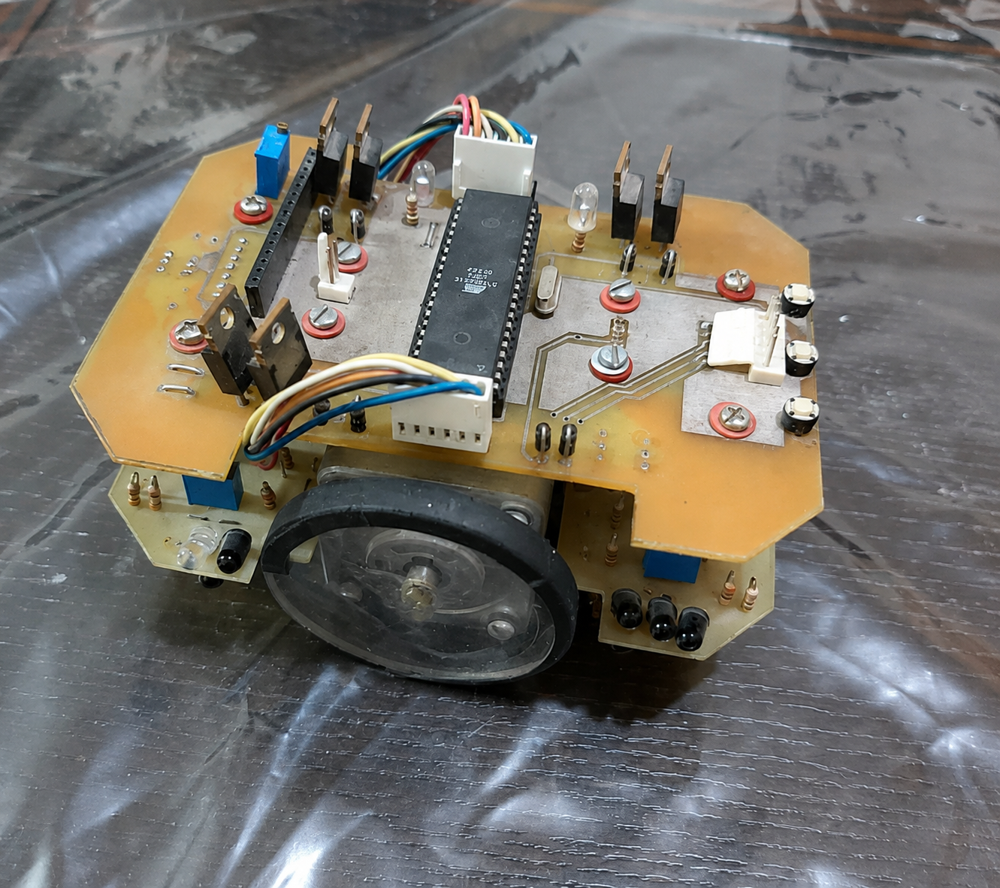
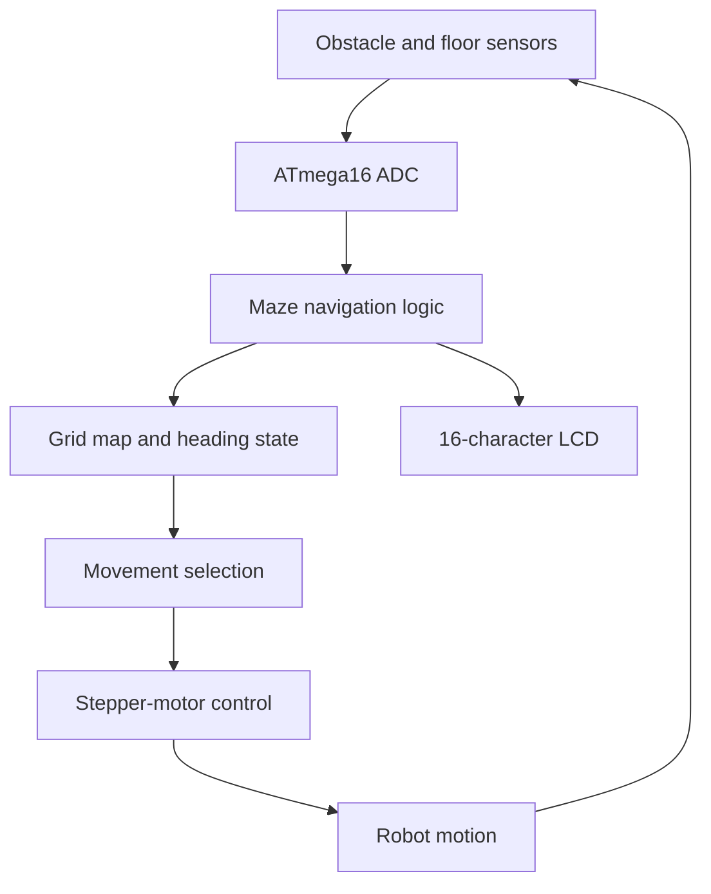

# ATmega16 Maze-Solving Robot

<p align="center">
  
</p>

<p align="center">
  <strong>An embedded autonomous robot that senses, maps, and navigates a bounded labyrinth.</strong>
</p>


## Overview

This repository preserves and documents an autonomous maze-solving robot developed as a bachelor-level embedded systems project. The robot uses an **ATmega16 microcontroller**, directional obstacle sensors, floor/path sensors, stepper-motor drive, and an LCD status display.

The firmware maintains the robot's grid position and heading, records the status of neighbouring cells, rejects blocked or out-of-bound moves, prioritises unexplored paths, and continues navigating until it reaches a configured goal.

## Key Features

- Four-direction obstacle detection: front, rear, left, and right
- Grid-based position and heading tracking
- Internal memory for visited, available, and blocked directions
- Goal detection using configurable grid coordinates
- Stepper-motor sequences for forward, reverse, left, and right motion
- Two floor sensors for path alignment and correction
- LCD feedback for sensor readings, position, success, and dead ends

## System Architecture



## Navigation Process

At every grid cell, the controller:

1. Reads the directional obstacle sensors.
2. Converts relative directions into candidate grid coordinates.
3. Rejects walls, detected obstacles, and maze boundaries.
4. Records open directions as unexplored or previously visited.
5. Prioritises unexplored moves before revisiting known paths.
6. Updates its grid position and compass heading.
7. Executes the selected stepper-motor sequence.
8. Uses the floor sensors to correct path alignment while moving.
9. Stops when the configured goal coordinate is reached.

## Repository Structure

```text
atmega16-maze-solving-robot/
├── assets/
│   └── robot.png
├── docs/
│   └── TECHNICAL_NOTES.md
├── legacy/
│   └── Labyrinth.CPP
├── src/
│   └── labyrinth_robot.c
└── README.md
```

- `src/labyrinth_robot.c` — documented source for continued maintenance.
- `legacy/Labyrinth.CPP` — untouched historical source from the original project.
- `docs/TECHNICAL_NOTES.md` — hardware assumptions, state representation, and known limitations.

## Development Environment

The program was written for **CodeVisionAVR** and uses toolchain-specific headers and syntax:

- `<mega16.h>` for ATmega16 registers
- `<delay.h>` for blocking delays
- `<lcd.h>` and the CodeVisionAVR LCD port directive
- `bit` variables provided by the compiler

It is therefore not expected to compile directly with standard desktop C/C++ compilers or `avr-gcc` without a small portability layer.

## Configuration

Important values are currently defined near the beginning of the source:

| Setting | Current value | Purpose |
|---|---:|---|
| Start cell | `(3, 1)` | Initial internal robot position |
| Goal cell | `(2, 5)` | Target grid coordinate |
| Maze boundary | rows `1–3`, columns `1–5` | Enforced by `promissing()` |
| Motor step delay | `4 ms` | Delay between stepper phases |
| Floor threshold | `150` | Path-sensor classification threshold |

Directional sensor thresholds are individually calibrated in the main loop.

## Historical Note

This is an archival robotics project. The original firmware is retained exactly in `legacy/`, while the maintained copy adds documentation and clearer repository organisation. Hardware-dependent motion constants and thresholds should be recalibrated before operating a rebuilt robot.

## Author

**Hoda Yamani**  
Machine learning, reinforcement learning, robotics, and intelligent systems

